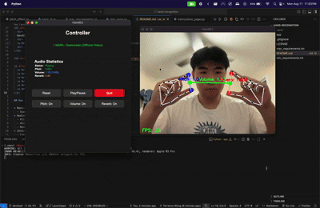

<h1 align="center">
  <br>
  HandDJ
  <br>
</h1>

<p align="center">
  
</p>

<h4 align="center">A gesture-controlled DJ application built using <a href="https://mediapipe.dev/" target="_blank">MediaPipe</a>.</h4>


<p align="center">
  <a href="#key-features">Key Features</a> •
  <a href="#how-to-use">How To Use</a> •
  <a href="#installation">Installation</a> •
  <a href="#controls">Controls</a> •
  <a href="#license">License</a>
</p>

## Key Features

* Real-time Hand Tracking - Control music with hand gestures
  - Uses MediaPipe for accurate hand detection and landmark tracking
* Audio Effects Control
  - Pitch manipulation with smooth transitions
  - Volume control through hand positioning
  - Reverb effects for enhanced sound quality
* Audio Processing
  - Real-time audio manipulation and effects
  - Uses YouTube link to get audio
  - Smooth parameter transitions to prevent audio artifacts
* Cross Platform
  - Works on Windows and macOS
  - Optimized for different operating system requirements

## How To Use

To clone and run this application, you'll need [Git](https://git-scm.com) and [Python 3.10](https://python.org) installed on your computer. From your command line:

```bash
# Clone this repository
$ git clone https://github.com/terryzhw/hand-recognition

# Go into the repository
$ cd hand-dj

# Install dependencies (macOS)
$ pip install -r mac_requirements.txt

# Install dependencies (Windows)
$ pip install -r win_requirements.txt

# Go to app 
$ cd app

# Run the application
$ python hand_dj.py
```

> **Note**
> Make sure your camera is connected and accessible before running the application.

## Controls

HandDJ uses computer vision to track your hand movements and translate them into audio controls:

* **Pitch Control** - Move your left index/thumb up and down to adjust the pitch of the audio
* **Volume Control** - Mvoe your hands apart/close to adjust volume of the audio
* **Reverb Effects** - Move your right index/thumb up and down to adjust the reverb of the audio

Navigate through the application using the GUI:
- **Main Page** - Start here to access all features
- **Instructions Page** - Learn how to use hand controls
- **Play Page** - Load YouTube link for audio
- **Control Page** - Monitor real-time audio parameters and access control buttons

## Installation

### Prerequisites

- Python 3.10 (I use 3.10.11)

### Dependencies

The application requires several Python packages for computer vision, audio processing, and GUI:

- **MediaPipe** - AI/ML tools and techniques
- **OpenCV** - Computer Vision Library
- **PyQt5** - GUI library
- **pygame/pydub/yt-dlp** - For real-time audio manipulation

Use the provided requirements files for your operating system to ensure compatibility.

## Support

If you encounter any issues or have questions about HandDJ, please open an issue on the GitHub repository.

## License

MIT

---

> Developed by Terrance Wong
